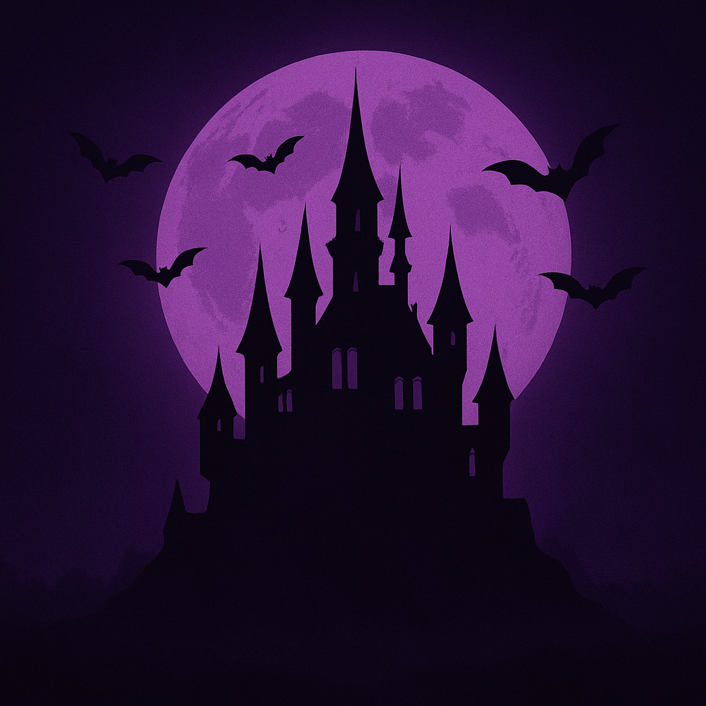

  
 <h1 align="center">Welcome — I'm Wieniec</h1> 
<em>Stoic game developer building atmospheric games with the Godot Engine.</em>

🕯️ About Me

👾 Game Developer based in the Netherlands, focused on creating immersive experiences.

🧩 Currently Building: a new Godot project (working title Gothic Realms). Expect dark puzzles, eerie atmospheres and smooth controls.

🏰 Past Project: TBH (To Be Haunted) — a narrative‑driven adventure built in Godot where players explore a cursed manor filled with cryptic riddles and hidden lore.

🔭 Learning: advanced Godot features, procedural level generation, and improved shader effects.

💬 Ask me about: game architecture, GDScript, and blending narrative with gameplay.

⚙️ Tech Stack & Tools

Here are some of the main tools and languages I use:

🐍 Languages: GDScript, C#, Python, and a pinch of C++ when needed.

🛠️ Engine & Frameworks: Godot Engine, GDNative, Node.js for tooling scripts.

💻 Environment: Arch Linux, VS Code, Fish Shell.

To display your tech stack visually you can use badges. For example, the Made with Godot badge below uses Shields.io: